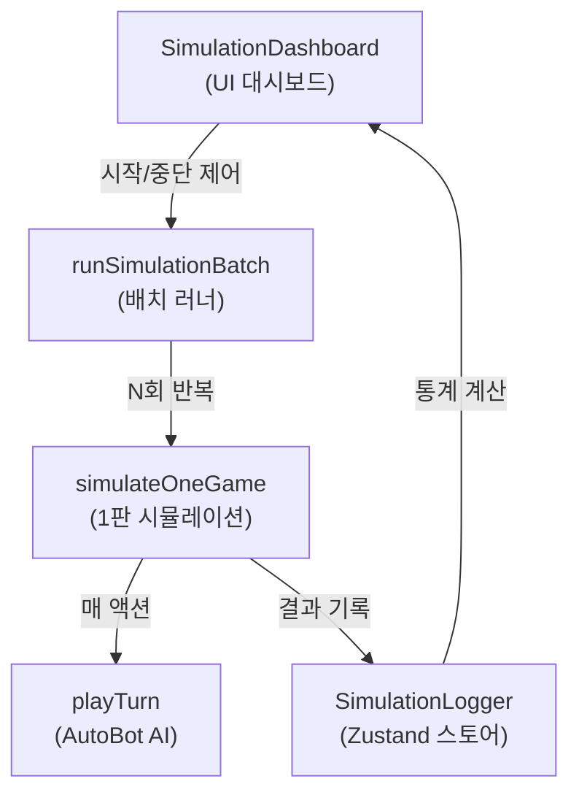

# 🤖 시뮬레이션 기능 설명

## 개요

**AutoBot 밸런스 시뮬레이터**는 AI 봇이 게임을 자동으로 수백~수천 회 반복 플레이하여 **게임 밸런스 데이터**를 수집하는 기능입니다. 개발자가 카드/자원 수치를 조정한 후 빠르게 결과를 검증할 수 있습니다.

---

## 아키텍처



### 구성 파일

| 파일 | 역할 |
|------|------|
| [AutoBot.ts](file:///c:/Work%20Folder/Game/Civilization_Card/src/simulation/AutoBot.ts) | 봇 AI (`playTurn`) + 1판 시뮬레이션 (`simulateOneGame`) + 배치 러너 (`runSimulationBatch`) |
| [SimulationLogger.ts](file:///c:/Work%20Folder/Game/Civilization_Card/src/simulation/SimulationLogger.ts) | 시뮬레이션 전용 Zustand 스토어, 결과 수집 및 통계 계산 |
| [SimulationDashboard.tsx](file:///c:/Work%20Folder/Game/Civilization_Card/src/components/screens/SimulationDashboard.tsx) | 시뮬레이션 조작 및 결과 표시 UI |

---

## AutoBot AI 의사결정

봇은 매 액션마다 아래 우선순위로 행동합니다:

```
① 핸드 카드 사용 (가치 높은 순)
② 상점 구매 (가치 높은 순, 시대 발전 카드 최우선)
③ 아무것도 못하면 → 페이즈 종료
```

**카드 가치 점수표:**

| 카드 유형 | 점수 | 비고 |
|-----------|------|------|
| 시대 발전 카드 | 100 | 상점에서 최우선 구매 |
| 패시브 건물 | 50 | 동굴 거주지 등 |
| 기술 카드 | 30 | 불의 발견 등 |
| 액션 카드 | 20 | 채집/사냥/연구 |
| 전투 유닛 | 15 | 공격력 보유 시 |
| 일반 건물 | 5 | 나무 방벽 등 |

**위기 대응 로직:**
- 조건 충족 → SUCCESS (보상 획득)
- 건물 있음 → HEDGE (건물 1개 파괴)
- 위 둘 다 실패 → STOP_LOSS (체력 10 + 필드 1개 파괴)

---

## 시뮬레이션 흐름

### `simulateOneGame()` — 1판 진행

1. `resetGame()` → `startGame([], 'NEANDERTHAL')` 초기화
2. `while` 루프: `playTurn()` 반복 호출
3. `gameover` 또는 `victory` 감지 시 종료
4. 결과 객체 반환 (승패, 턴 수, 시대 도달 턴, 위기 대응 횟수, 사망 원인)

### `runSimulationBatch(runs)` — N판 배치

1. `startSimulation(runs)` — 스토어 초기화
2. N회 반복: `simulateOneGame()` → `addResult()` → 로그 기록
3. 매 판 사이 `setTimeout(0)`으로 UI 렌더링 프레임 양보
4. 완료 시 `finishSimulation()` → 통계 자동 계산

---

## 수집 통계

| 지표 | 설명 |
|------|------|
| **승률** | `wins / totalRuns × 100%` |
| **평균 생존 턴** | 전체 게임의 평균 종료 턴 |
| **시대별 도달 턴** | 각 시대(1~5)에 최초 진입한 평균 턴 수 |
| **위기 대응 분포** | SUCCESS / HEDGE / STOP_LOSS 평균 횟수 |
| **사망 원인** | 식량 아사(`starvation`) / 위기 피해(`crisis_damage`) / 기타 |

---

## 사용 방법

1. 메인 메뉴에서 **시뮬레이션** 진입
2. 횟수 입력 (기본 100, 최대 10000)
3. **▶ 시뮬레이션 시작** 클릭
4. 실시간 로그로 각 판 결과 확인
5. 완료 후 **리포트 패널**에서 통계 확인
6. 밸런스 수치 조정 후 재실행하여 비교
